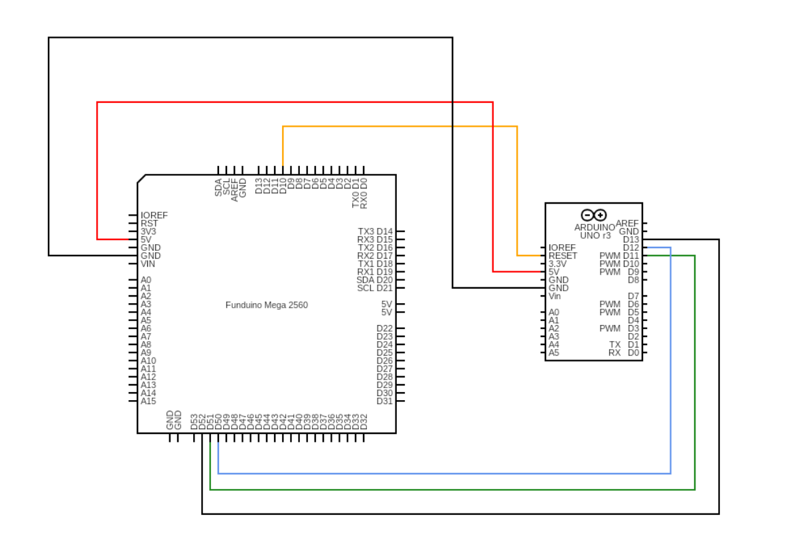

## Raw SRAM Memory Content Collection Module

This module is dedicated to collecting raw SRAM memory content on Arduino Uno.

### General workflow of this module can be described as follows:
1. Burn the bootloader on the Arduino Uno board:
*  This can be done by using another board as a parallel programmer [more details](https://support.arduino.cc/hc/en-us/articles/4841602539164-Burn-the-bootloader-on-UNO-Mega-and-classic-Nano-using-another-Arduino#ide). We are using Funduino Mega board (having same configurations as Arduino Mega) as a parallel programmer.
*  Perform necessary connections between Funduino Mega as a programming board and Arduino Mega as a target board (more about pin connection details in the above link). Pictorial illustration below 

Hamming Distance is calculated upon generating responses.
